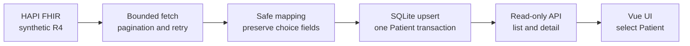
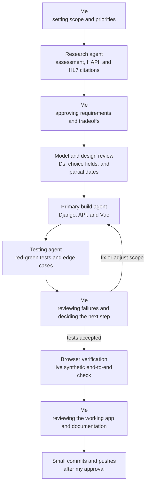

# FHIR Migration Plan

> Status: the complete take-home flow was verified on July 14, 2026. It includes bounded FHIR migration, SQLite persistence, a read-only API, a Vue UI, 60 backend tests, 2 frontend tests, and a live synthetic browser check.

## Take-home flow

This is intentionally a bounded sample. A large production backfill needs a different extraction and storage strategy.

## Data mapping

| Data | Decision |
|---|---|
| Patient identity | Use `(source_system, fhir_id)` as the unique key. A FHIR ID is not treated as an MRN. |
| Patient details | Keep names, identifiers, contact fields, partial birth dates, and the decoded synthetic resource. Expose only a small safe summary through the API. |
| Observation link | Accept an exact `Patient/{id}` subject and store a protected Patient foreign key. |
| Observation result | Preserve `value[x]`, `dataAbsentReason`, components, ranges, codes, and effective time without assuming `valueQuantity`. |

## Reliability and safety

- Requests use explicit connect/read timeouts.
- Retries are limited to transport failures and `429`, `502`, `503`, and `504` responses.
- Opaque pagination links are followed exactly; direct cross-origin next links are rejected.
- Reruns are idempotent and counted as inserted, updated, or unchanged.
- A bad Patient unit rolls back and fails the run with a sanitized phase and aggregate counters.
- The take-home does not claim durable resume, quarantine, authentication, deployment, or full FHIR profile validation.
- Only synthetic HAPI data is used. Real PHI requires approved encryption, access control, audit, retention, and logging policies.

## How AI was used

The research step checked the assignment, the live HAPI CapabilityStatement, live search behavior, and official FHIR R4 documentation. I reviewed the requirements and tradeoffs before implementation, reviewed test failures before fixes or scope changes, and reviewed the working application and documentation before publishing. The browser check verified the final command, API, and UI together.

## Production extension order

1. **Confirm the source contract:** cohort, profiles, auth, limits, deletions, and retention.
2. **Scale extraction:** use asynchronous Bulk FHIR `$export` when supported; stream NDJSON and persist durable checkpoints.
3. **Improve data quality:** add agreed profile validation and an encrypted quarantine with safe reason codes.
4. **Scale storage:** move to PostgreSQL, batch upserts, reconcile counts, and publish from run-scoped staging.
5. **Add incremental sync:** use `_since` or `_lastUpdated` with overlap and idempotent replay.
6. **Secure and operate:** add authorization, pagination, indexes, CI, deployment, monitoring, secrets, and recovery drills.

## Sources

- [Credo Health take-home assessment](https://credo-health.fibery.io/Hiring/Assessments/Full-Stack-Python-Take-Home-Exercise-1?sharing-key=f442622a-cb82-46b5-af49-350e0e2d3837)
- [Live HAPI FHIR R4 CapabilityStatement](https://hapi.fhir.org/baseR4/metadata)
- [FHIR R4 Patient](https://hl7.org/fhir/R4/patient.html) and [Observation](https://hl7.org/fhir/R4/observation.html)
- [FHIR R4 search and pagination](https://hl7.org/fhir/R4/search.html)
- [FHIR Bulk Data export](https://build.fhir.org/ig/HL7/bulk-data/export.html)
