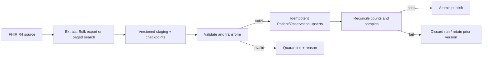

# FHIR R4 Patient and Observation Migration Plan

> Status: living plan for the take-home and its production-scale design. Backend milestone 1 (Django/DRF scaffold, SQLite, core models, migration, and model tests) was verified on 2026-07-13 PT; extraction, the read API, and the frontend remain pending. Last source verification: 2026-07-13 PT. Unknown production facts are listed as go-live gates instead of being assumed.

## 1. Migration steps

1. **Discover and freeze scope.** Read the source `CapabilityStatement`, confirm the Patient cohort, eligible Observation types, profiles, authentication, rate limits, deletion behavior, and an extraction cutoff time.
2. **Extract.** For the take-home, fetch a bounded Patient sample and each patient's Observations as FHIR JSON. For a production backfill, prefer asynchronous Bulk FHIR `$export` when the source confirms it is supported.
3. **Land and checkpoint.** Record a `MigrationRun`, retain the source resource ID/version metadata, and checkpoint completed pages/files so a stopped run can resume safely.
4. **Transform.** Validate `resourceType`, map the FHIR resources into the internal schema below, and quarantine malformed or out-of-scope records with a reason.
5. **Load idempotently.** Upsert by `(source_system, fhir_id)` in bounded transactions; load Patients before Observations and enforce the foreign key.
6. **Reconcile.** Compare extracted, accepted, rejected, and persisted counts; check duplicates, relationships, mapped values, and a deterministic sample against the source.
7. **Publish.** Promote only a fully validated run. Keep the previous published dataset available until acceptance is complete.
8. **Operate or roll back.** Monitor progress and retry only transient failures. Resume from a checkpoint, discard an unpromoted run, or switch back to the prior dataset if validation fails.

## 2. Verified source behavior and decisions

The assignment specifies a synthetic-data-only migration of about 50,000 Patients and their Observations from FHIR R4, plus a Django/Python or equivalent backend, local persistence, a read REST API, a Vue or equivalent UI, deliberate external-API failure handling, meaningful backend tests, a README, and AI-use disclosure. Authentication, deployment, visual polish, real-time sync, and UI pagination are explicitly out of scope for the working slice.

The live sandbox `https://hapi.fhir.org/baseR4` currently advertises FHIR `4.0.1`, JSON and XML, Patient and Observation `read`/`search-type`, Observation `subject` and `patient` search parameters, `_lastUpdated`, and system `$export`. Live checks returned searchset Bundles with opaque `link[relation="next"].url` values. A real `$export?_type=Patient,Observation` kickoff returned `202 Accepted` and a polling URL; polling returned `202` with `Retry-After: 120`. At verification time the volatile sandbox reported 46,449 Patients and 132,466 Observations; these are evidence that the dataset is substantial, not acceptance counts, because the public server is periodically reset.

**Working-slice decision:** use `Accept: application/fhir+json`, Django + Django REST Framework, SQLite, Vue 3, and a management command such as `migrate_fhir --patient-limit 10`. Fetch Patients from `/Patient?_count=<limit>` and Observations from `/Observation?subject=Patient/{id}&_count=100`, following any server-provided `next` URL. Expose `GET /api/patients/` and `GET /api/patients/{id}/` (including Observations); the Vue screen lists migrated Patients and opens the selected Patient's results. The source URL and limits remain configuration. The README will contain setup/run commands, AI-use disclosure, and prioritized next work.

**Production decision:** use system-level Bulk Data export for the initial backfill because it avoids roughly one Observation request per Patient and returns streamable NDJSON files. Poll exactly as directed by `Retry-After`, stream files instead of loading them into memory, verify the manifest, and bound concurrent downloads/workers. If Bulk Data is unavailable, page through Patient and Observation searches separately and always follow the exact server-provided `next` URL. `_revinclude=Observation:subject` is supported by this sandbox, but would be adopted only after source-specific volume testing. For later deltas, use Bulk `_since` or `_lastUpdated` with a recorded high-watermark, a small overlap window, and idempotent upserts. Page size, concurrency, and requests/second are configuration values agreed with the source owner; the current CapabilityStatement publishes no numeric rate limit.

Every request has connect/read timeouts. Retry idempotent GET/status/download calls only for transport errors, `429`, `502`, `503`, and `504`, honoring `Retry-After`; otherwise use capped exponential backoff with jitter. Retries are bounded, permanent `4xx` responses fail deliberately, and FHIR `OperationOutcome` details are sanitized before logging. A circuit breaker pauses extraction after sustained source failure.

## 3. Internal mapping

FHIR fields are optional and repeating, so transformers must be null-safe and must not silently choose clinical meaning. The take-home keeps `raw_resource` JSON for traceability because all data is synthetic. Production raw-resource retention requires an approved encrypted store and retention period.

| Internal entity | FHIR source | Mapping rule |
|---|---|---|
| `Patient` identity | `Patient.id`, `meta.versionId`, `meta.lastUpdated` | Store as `fhir_id` plus source metadata; `Patient.id` is not treated as an MRN. Unique on `(source_system, fhir_id)`. |
| Patient display | `name[]`, `gender`, `birthDate`, `active` | Preserve names as JSON; derive `display_name` deterministically for UI only. Store administrative gender as supplied and nullable birth date/active. |
| Patient contact | `identifier[]`, `telecom[]`, `address[]`, `communication[]` | Preserve normalized arrays. Do not select a canonical identifier, phone, or address until a business rule is agreed. |
| `Observation` identity/link | `Observation.id`, `subject.reference` | Unique on `(source_system, fhir_id)`; resolve only `Patient/{id}` subjects to the Patient foreign key. Quarantine unresolved or out-of-cohort references. |
| Observation meaning | `status`, `category[]`, `code.coding[]`, `code.text` | Preserve all categories/codings; derive a display label without discarding coding system and code (for example LOINC). |
| Observation result | `value[x]`, `dataAbsentReason`, `component[]`, `referenceRange[]` | Store `value_type` and typed JSON value, with optional numeric/text/unit columns for querying. Do not assume `valueQuantity`; FHIR R4 permits quantity, concept, string, boolean, integer, range, ratio, sampled data, time, date-time, and period. Preserve components and absent reasons. |
| Observation time | `effective[x]`, `issued`, `meta.lastUpdated` | Preserve the effective type/value; populate a queryable timestamp only when the source supplies a date-time. Keep issued and source update times separate. |

Production uses PostgreSQL, batch upserts, and indexes on Patient source ID plus Observation `(patient_id, effective_at)`, code, and source update time. At-least-once processing plus unique constraints is preferred to a fragile claim of exactly-once delivery.

## 4. Validation, observability, safety, and rollback

Each `MigrationRun` records extraction mode, cutoff/transaction time, status, checkpoint, request/retry counts, and totals for discovered, parsed, accepted, rejected, inserted, updated, and unchanged records. Structured logs and metrics include `run_id`, resource type, latency, retries, rate-limit responses, queue depth, and sanitized error codes, never names, birth dates, identifiers, clinical values, raw bodies, or signed download URLs.

Acceptance requires: (1) every discovered Patient and eligible Observation is persisted or accounted for in quarantine; (2) no duplicate source keys or orphan Observations; (3) rerunning the same input creates no duplicates; (4) required internal types and relationships are valid; (5) source-to-target checks pass for a reproducible ID sample and boundary cases such as missing names, no value, non-quantity values, components, and Patients with no Observations. Transformer tests cover these cases; client tests cover pagination, retry then success, permanent failure, and malformed FHIR. API tests cover `GET /api/patients/` and `GET /api/patients/{id}/` with nested Observations.

The repository uses only the sandbox's synthetic records. In a real migration, PHI must stay out of source control, fixtures, screenshots, analytics, exception trackers, and logs. Use least-privilege service credentials, TLS in transit, encryption at rest and for temporary files, managed secrets, restricted networks, audited access, approved retention/deletion, and a vendor/BAA review as applicable. These production controls follow the HIPAA Security Rule's access-control, audit, integrity, authentication, and transmission-security safeguards; authentication remains out of scope only for this exercise.

Production writes to a run-scoped staging version. Validation failure leaves the current version untouched and deletes or retains the failed version according to policy. A stopped run resumes at the last completed file/page; replay is safe because writes are idempotent. After promotion, rollback atomically restores the previous version, records the reason and affected run, and retains reconciliation evidence. In the take-home, each Patient and its Observations are written in one database transaction; a failed unit rolls back, is reported, and can be retried without duplication.

## 5. Production go-live gates

Before a real run, the source and product owners must confirm: the exact Patient cohort; eligible Observation categories/codes/statuses; source profiles/extensions; identifier and contact precedence; auth/token lifetime; numeric rate/concurrency limits; Bulk export support and file expiry; update/delete/history semantics; cutoff and downtime expectations; PHI retention; reconciliation thresholds; rollback owner; and final sign-off. None of these unspecified values is inferred from the public sandbox.

## References

- [Credo Health take-home instructions](https://credo-health.fibery.io/Hiring/Assessments/Full-Stack-Python-Take-Home-Exercise-1?sharing-key=f442622a-cb82-46b5-af49-350e0e2d3837)
- [Live HAPI FHIR R4 CapabilityStatement](https://hapi.fhir.org/baseR4/metadata)
- [FHIR R4 Patient](https://hl7.org/fhir/R4/patient.html), [Observation](https://hl7.org/fhir/R4/observation.html), [Search](https://hl7.org/fhir/R4/search.html), and [Bundle](https://hl7.org/fhir/R4/bundle.html)
- [HL7 Bulk Data Access: Export](https://build.fhir.org/ig/HL7/bulk-data/export.html)
- [HHS HIPAA Security Rule summary](https://www.hhs.gov/hipaa/for-professionals/security/laws-regulations/index.html)

## Decision log

| Decision | Reason / revisit trigger |
|---|---|
| JSON for the implementation | Verified server support; direct Python/JavaScript handling; FHIR-native content type. Revisit only if the real source contract requires XML. |
| Bounded search for the working slice; Bulk export for production backfill | Matches the assessment's time box while showing a scalable path. Revisit after real source capability and load tests. |
| Preserve repeating/choice fields and raw synthetic resources | Avoids silent loss while providing queryable simplified fields. Revisit production raw retention after PHI/security review. |
| Django 5.2.16 and Django REST Framework 3.17.1 | Reproducible supported dependencies for the locally available Python 3.11 runtime. Upgrade deliberately after running the full test suite. |
| Preserve `Patient.birth_date` as a nullable FHIR date string | FHIR dates may have year or year-month precision, which a Django `DateField` cannot represent without inventing a day. Validate source syntax in the transformer milestone. |
| Protect Patients that have Observations | `PROTECT` avoids silently deleting dependent clinical records before source deletion semantics are agreed. The ingestion layer must invoke model validation so Patient and Observation source systems cannot diverge. |
