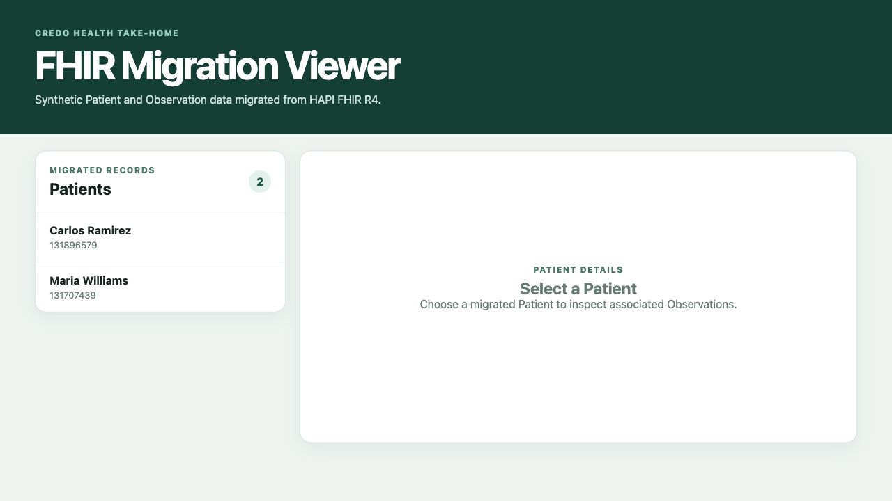
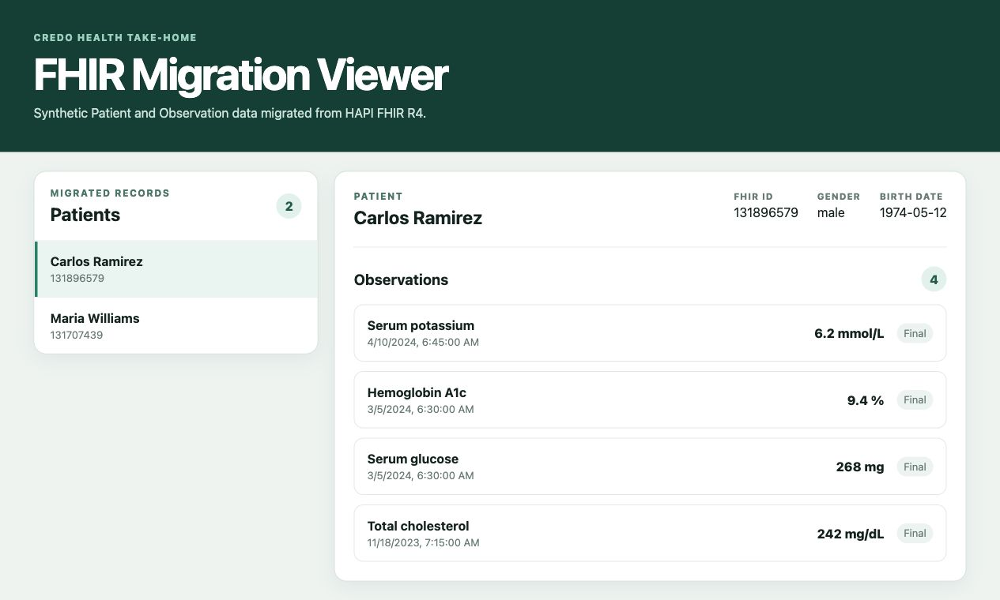

# Credo Health FHIR Migration

A small end-to-end take-home application:

```text
HAPI FHIR -> Django command -> SQLite -> REST API -> Vue UI
```

It migrates a limited number of synthetic Patients and their Observations, stores them locally, and displays them in a browser.

## Repository structure

```text
.
├── backend/
│   ├── config/                         # Django settings and URLs
│   ├── fhir_migration/
│   │   ├── management/commands/        # migrate_fhir command
│   │   ├── migrations/                 # Database schema migrations
│   │   ├── services/                   # FHIR client, mapping, and ingestion
│   │   ├── tests/                      # Backend tests
│   │   ├── models.py                   # Patient, Observation, MigrationRun
│   │   └── serializers.py, views.py    # Read-only REST API
│   └── manage.py
├── frontend/
│   └── src/                            # Vue UI, API client, styles, and tests
├── docs/screenshots/                   # Verified UI screenshots
├── Plan.md                             # Decisions and production extensions
└── README.md                           # Setup and project overview
```

## Run it

Backend:

```bash
python3 -m venv .venv
source .venv/bin/activate
python -m pip install -r backend/requirements.txt
cd backend
python manage.py migrate
python manage.py migrate_fhir --patient-limit 10
python manage.py runserver
```

Frontend, in another terminal:

```bash
cd frontend
npm ci
npm run dev
```

Open [http://127.0.0.1:5173](http://127.0.0.1:5173).

## Test it

```bash
source .venv/bin/activate
cd backend
python manage.py test
python manage.py check
python manage.py makemigrations --check --dry-run

cd ../frontend
npm ci
npm test
npm run build
```

Verified on July 14, 2026:

- 60 backend tests passed.
- 2 frontend tests passed.
- The frontend production build passed.
- A live run migrated 2 Patients and 4 Observations.
- Rerunning the same sample produced 6 unchanged records and no duplicates.

## API

- `GET /api/patients/` — Patient list
- `GET /api/patients/{database_id}/` — Patient details with Observations

## Main decisions

- Use a configurable Patient limit so reviewers do not need to migrate the full sandbox.
- Follow FHIR pagination and retry only temporary failures with timeouts and bounded backoff.
- Upsert by source and FHIR ID so reruns are safe.
- Save each Patient and its Observations in one transaction.
- Preserve FHIR repeating and choice fields instead of assuming every result is a quantity.
- Keep SQLite and the UI intentionally simple for the take-home.
- Use synthetic sandbox data only; real PHI needs production security controls.

The source URL, limits, page sizes, timeouts, and retry settings can be changed with the `FHIR_*` environment variables in `backend/config/settings.py`.

## What comes next

For production, add Bulk FHIR export, PostgreSQL batch upserts, durable checkpoints, quarantine, authentication, API/UI pagination, monitoring, and deployment automation. The order and reasons are in [Plan.md](Plan.md).

## AI usage

OpenAI Codex assisted with research, implementation, tests, browser verification, and documentation. I stayed in the loop for scope, decisions, testing, commits, and pushes. See the workflow diagram in [Plan.md](Plan.md).

## Screenshots

**Patient list**



**Patient details and Observations**


